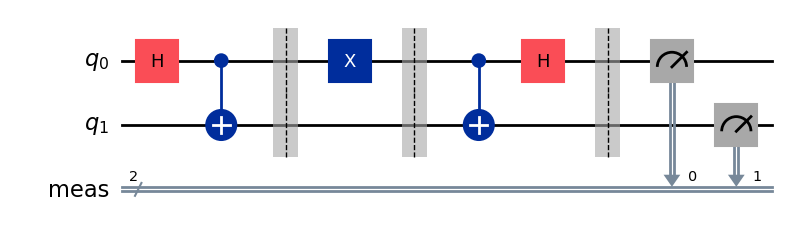
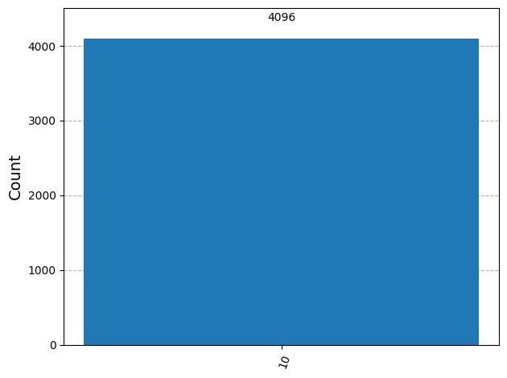
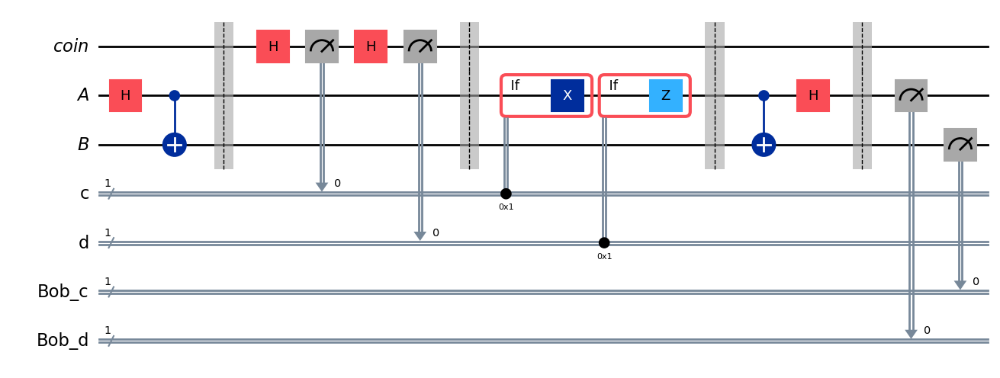
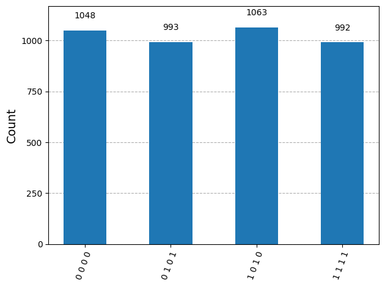

# Quantum Superdense Coding: Entanglement Assisted Classical Communication using Qiskit

A Qiskit-based implementation and experimental verification of the **Superdense Coding Protocol**. It is the quantum information protocol that allows two classical bits to be transmitted using only a single qubit of quantum communication, provided the sender and receiver pre-share one entangled qubit pair (e-bit). The protocol is implemented for a fixed classical input and independently re-validated using a randomized bit generator, with all results confirmed on the Qiskit Aer simulator.

---

## Table of Contents

1. [Overview](#overview)
2. [Theoretical Background](#theoretical-background)
   - [2.1 Superdense Coding and Holevo's Theorem](#21-superdense-coding-and-holevos-theorem)
   - [2.2 Protocol Setup](#22-protocol-setup)
   - [2.3 Mathematical Analysis of the Protocol](#23-mathematical-analysis-of-the-protocol)
3. [Project Structure](#project-structure)
4. [Requirements and Installation](#requirements-and-installation)
5. [Implementation](#implementation)
   - [5.1 Circuit Construction (Fixed Classical Bits)](#51-circuit-construction-fixed-classical-bits)
   - [5.2 Simulation Results (Fixed Input)](#52-simulation-results-fixed-input)
   - [5.3 Randomized Bit Generator Implementation](#53-randomized-bit-generator-implementation)
   - [5.4 Simulation Results (Randomized Input)](#54-simulation-results-randomized-input)
6. [Results Summary](#results-summary)
7. [Merits](#merits)
8. [Limitations](#limitations)
9. [Conclusion](#conclusion)

---

## Overview

Superdense coding is a quantum communication protocol that encodes **two classical bits into a single qubit**, with the condition that the sender ("Alice") and receiver ("Bob") already share one half each of an entangled Bell pair (an e-bit). It achieves an aim complementary to quantum teleportation: where teleportation uses two classical bits and one e-bit to transmit one qubit, superdense coding uses one e-bit and one transmitted qubit to communicate two classical bits.

This project implements the full protocol in Qiskit, verifies it against the theoretical predictions of Bell-state transformations, and validates it under two conditions:
1. A **fixed, known 2-bit input** (`c = 1`, `d = 0`), used to confirm deterministic correctness.
2. A **randomized 2-bit input**, generated on-circuit using an additional "coin" qubit, used to confirm the protocol holds across all four possible messages.

## Theoretical Background

### 2.1 Superdense Coding and Holevo's Theorem

Sending a qubit is technologically far more demanding than sending a classical bit. Without shared entanglement, a single transmitted qubit cannot communicate more than one classical bit of information. This is a consequence of **Holevo's theorem**. Superdense coding demonstrates that this limit can be broken *if* entanglement is pre-shared:

> "Shared entanglement can effectively double the classical information capacity of a transmitted qubit."

Although transmitting qubits remains more difficult than transmitting classical bits, superdense coding is significant because it gives a clean, minimal demonstration of how entanglement enhances the capacity of quantum communication.

### 2.2 Protocol Setup

Consider a sender **Alice**, who holds qubit `A`, and a receiver **Bob**, who holds qubit `B`. Alice and Bob share one e-bit of entanglement (a Bell pair). Alice wants to send two classical bits, `c` and `d`, to Bob — and does so by sending only qubit `A`.

**Circuit operation:**

Alice's encoding (applied to her qubit `A` only):
- If `d = 1`, Alice applies a **Z gate** to qubit `A`. If `d = 0`, she does nothing.
- If `c = 1`, Alice applies an **X gate** to qubit `A`. If `c = 0`, she does nothing.

After Bob receives qubit `A`, his decoding:
- He applies a **CNOT gate** (control = `A`, target = `B`).
- He applies a **Hadamard gate** to `A`.
- He measures both qubits `A` and `B` in the standard basis to recover `d` and `c` respectively.

### 2.3 Mathematical Analysis of the Protocol

Alice and Bob initially share the Bell state |φ⁺⟩. Depending on the classical bits `c` and `d`, Alice's gates either leave this state unchanged or shift it to one of the other three Bell states:

| Alice's operation | Resulting Bell state |
|---|---|
| I (c=0, d=0) | \|φ⁺⟩ |
| Z (c=0, d=1) | \|φ⁻⟩ |
| X (c=1, d=0) | \|ψ⁺⟩ |
| XZ (c=1, d=1) | \|ψ⁻⟩ |

After Bob's decoding operations (CNOT then Hadamard on Alice's qubit), the four Bell states map onto the four computational basis states:

| Bell state | Decoded basis state |
|---|---|
| \|φ⁺⟩ | \|00⟩ |
| \|φ⁻⟩ | \|01⟩ |
| \|ψ⁺⟩ | \|10⟩ |
| \|ψ⁻⟩ | \|11⟩ |

Bob's measurement therefore reveals exactly which Bell state Alice prepared and hence exactly which 2-bit message she sent, using only the single qubit `A` that was physically transmitted.

**Verification cases** confirmed in this project:
- `cd = 00` → Bob recovers `00`
- `cd = 01` → Bob recovers `01`
- `cd = 10` → Bob recovers `10`
- `cd = 11` → Bob recovers `11` (up to an overall global phase of −1, which is unobservable)

## Project Structure

```
├── README.md
├── superdense_Coding.ipynb      # Main notebook (protocol, simulations, analysis)
├── superdense_coding.py
└──images/
    ├── circuit_fixed_input.png        # Circuit diagram for fixed classical bits (c=1, d=0)
    ├── histogram_fixed_input.png      # Measurement histogram for fixed input
    ├── circuit_randomized.png         # Circuit diagram with random bit generator
    └── histogram_randomized.png       # Measurement histogram for randomized input

```

## Requirements and Installation

This project was built and tested with:
- `qiskit` v2.1.0 or newer
- `qiskit-aer` v0.17.0 or newer
- `pylatexenc` (required for circuit diagram rendering)

Install the dependencies with:

```bash
pip install qiskit
pip install qiskit-aer
pip install pylatexenc
```

## Implementation

### 5.1 Circuit Construction (Fixed Classical Bits)

The protocol circuit is first built for a fixed, known message (`c = '1'`, `d = '0'`) to verify correctness deterministically. The circuit:
1. Prepares the shared e-bit using a Hadamard gate followed by a CNOT.
2. Applies Alice's conditional Z/X encoding gates based on `c` and `d`.
3. Applies Bob's CNOT + Hadamard decoding gates.
4. Measures both qubits.



### 5.2 Simulation Results (Fixed Input)

Running this circuit on the Qiskit Aer simulator for 4096 shots produces a single deterministic outcome:



With the input fixed (`c = 1`, `d = 0`), Bob measures `"10"` in **100% of all 4096 shots**. This confirms that Alice's encoding gates (I, X, Z, or XZ) and Bob's decoding operations (CNOT + Hadamard) correctly recover the transmitted 2-bit message with zero error on an ideal simulator.

### 5.3 Randomized Bit Generator Implementation

To validate the protocol across *all* possible 2-bit messages rather than a single fixed case, an additional "coin" qubit is introduced as a random bit generator. This coin qubit is measured twice (with a Hadamard gate applied before each measurement) to randomly generate Alice's bits `c` and `d` on-circuit, before running the same encode/decode protocol. Bob's independently measured output bits are also recorded for direct comparison against Alice's randomly generated input bits.



### 5.4 Simulation Results (Randomized Input)

Running this randomized-input circuit for 4096 shots on the Aer simulator produces the following distribution:



| Outcome (Alice `cd`, Bob `cd`) | Approx. Probability |
|---|---|
| 0000 | ≈ 25.6% |
| 0101 | ≈ 24.2% |
| 1010 | ≈ 26.0% |
| 1111 | ≈ 24.2% |

Each 4-bit outcome is structured as Alice's bits followed by Bob's bits (`c_Alice d_Alice c_Bob d_Bob`). Only the four "repeated-pair" outcomes (0000, 0101, 1010, 1111) are ever observed — outcomes where Alice's and Bob's bits *don't* match (e.g. 0001, 0110) would represent a decoding error, and since the simulation is noiseless and exact, these never occur. This confirms that Bob's decoded bits are bit-for-bit identical to Alice's randomly generated bits in **every single shot**, across all four possible messages, with the near-uniform ~25% split across outcomes reflecting the randomness of the coin qubit rather than any protocol error.

## Results Summary

- **Fixed-input test:** 100% success rate (4096/4096 shots) in recovering the exact transmitted message `cd = 10`.
- **Randomized-input test:** 100% success rate across all four possible 2-bit messages, with no decoding errors observed in any of the 4096 shots.
Both experiments confirm the theoretical prediction that superdense coding allows a single transmitted qubit, combined with one pre-shared e-bit, to reliably communicate two classical bits.

## Merits

- **Doubles classical channel capacity:** Demonstrates that entanglement allows one transmitted qubit to carry two classical bits, directly illustrating the practical consequence of Holevo's theorem.
- **Deterministic, verifiable and randomized validation:** The protocol was validated both for a fixed test case and for a full random sweep of all four possible messages, giving strong confidence in correctness. Going beyond a single fixed test case, the on-circuit random bit generator confirms protocol correctness is not an artifact of one specific input.

## Limitations

- **Ideal simulator only:** All results were obtained on the noiseless Qiskit Aer simulator. No noise model or real quantum hardware execution was used, so realistic error rates, decoherence, and gate infidelities are not captured.
- **Small-scale demonstration:** The protocol is shown for a single 2-bit message per run; it does not address scaling to multi-qubit / multi-bit generalized dense coding schemes.

## Conclusion

Both the fixed deterministic case and the fully randomized case validations confirm **100% fidelity** of the superdense coding protocol implemented here. Bob correctly recovers Alice's two classical bits from a single transmitted qubit in every shot, for every possible input combination. This validates the theoretical claim that shared entanglement doubles the classical information capacity of a single transmitted qubit, and provides a clean, hardware-independent demonstration of one of quantum information theory's foundational results.

---
